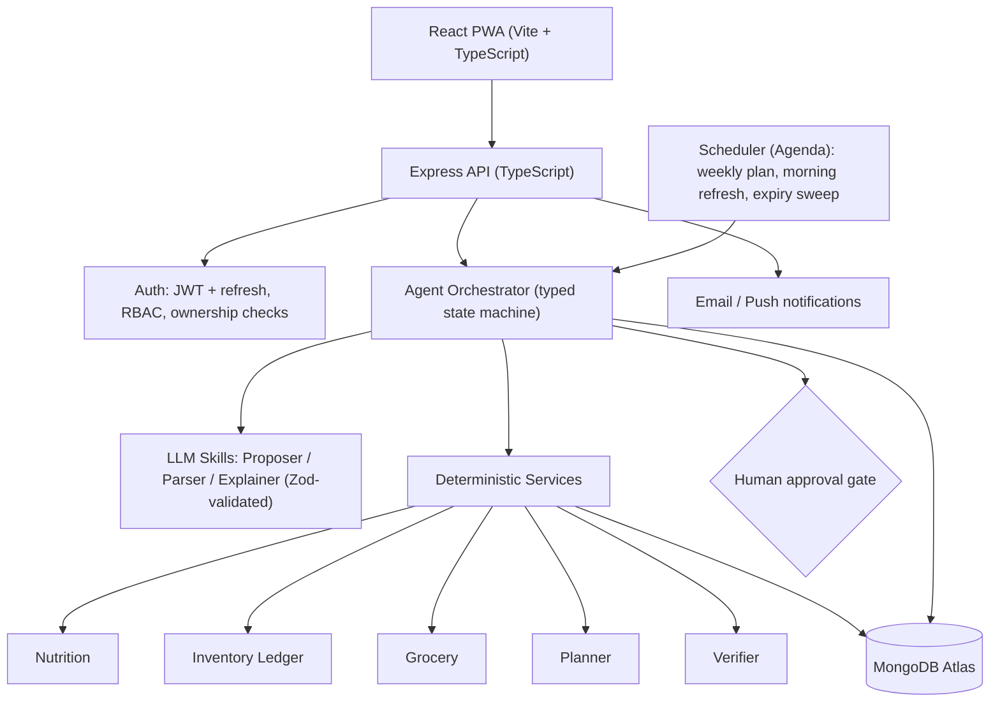

# 🥗AI Food-Management Agent

> An agentic meal-planning, nutrition, grocery and kitchen-inventory system built on the MERN stack. **The LLM proposes; deterministic code decides.**

---

## Table of Contents
1. [Problem](#problem)
2. [Key Features](#key-features)
3. [Design Philosophy](#design-philosophy-llm-vs-deterministic)
4. [Architecture](#architecture)
5. [Tech Stack](#tech-stack)
6. [Core Workflow](#core-workflow)
7. [Data Model](#data-model)
8. [Project Structure](#project-structure)
9. [Getting Started](#getting-started)
10. [Environment Variables](#environment-variables)
11. [API Overview](#api-overview)
12. [Testing & Evaluation](#testing--evaluation)
13. [Safety & Privacy](#safety--privacy)
15. [Limitations](#limitations)

---

## Problem

People repeatedly spend time deciding what to eat, finding recipes, tracking protein and calories, planning groceries, and dealing with food that expires unused. Existing apps handle one piece each. NutriAgent coordinates all of them in one loop:

```
Goals → Meal Plan → Inventory Check → Nutrition/Budget Optimization → Grocery List
      → User Approval → Purchase → Consumption Tracking → Inventory Update → Feedback → Replanning
```

## Key Features

- **Personalized targets:** BMR/TDEE-based calorie and protein targets from goals (lose / gain / maintain), user-confirmed.
- **Weekly meal planning:** respects diet type, allergies, dislikes, cook time, equipment, budget and household size.
- **Reliable nutrition:** calories, protein, carbs, fats and fiber computed from ingredient grams × food-database values. Never LLM-generated numbers.
- **Inventory ledger:** append-only transactions, FEFO (first-expiring-first-out) deduction, expiry estimates, confidence scores.
- **Smart grocery list:** plan minus current stock, pack-size aware, only what you actually need.
- **Use Soon:** ingredients nearing expiry are prioritized in the planner ("Spinach expires in 2 days: here are 3 meals").
- **Adaptive replanning:** skip a meal, eat out, swap dinner, add guests, or buy something unexpectedly, and only the affected part of the plan is recalculated.
- **Human approval:** plans, target changes, allergen-adjacent substitutions and grocery lists require explicit approval. The app never purchases anything automatically.
- **Schema-bound LLM skills:** free-text inventory/meal-log parsing and recipe proposals validated with Zod before use.

## Design Philosophy: LLM vs Deterministic

| LLM (creative / linguistic) | Deterministic backend (must be correct) |
|---|---|
| Parse free text to structured suggestions | Nutrition math and unit conversion |
| Propose candidate recipes with ingredients in grams | Inventory arithmetic, ledger, FEFO, expiry |
| Explain plan changes in plain language | Meal-plan optimization and constraint checks |
| Rank possible food matches | Grocery diffing, pack sizes, budget |
| | Allergen/diet enforcement, verification |
| | Auth, validation, database operations |

Rules the system follows:
1. LLMs never produce numbers that get stored (calories, grams, prices, dates).
2. LLMs never write to the database. They emit proposals that are validated, verified, and (if low-confidence) user-confirmed.
3. Allergens, budget and safety limits are enforced in code, not in prompts.
4. If the LLM is unavailable, the app degrades to a deterministic planner over a cached recipe pool.

## Architecture



**Agent flow (weekly plan):**
`load_state → propose_candidates → resolve_foods → nutrition_calc → hard_filters → optimize → verify (+repair loop) → grocery_diff → await_approval`

## Tech Stack

| Layer | Technology |
|---|---|
| Frontend | React, TypeScript, Vite, Tailwind CSS, PWA |
| Backend | Node.js, Express.js, TypeScript |
| Database | MongoDB (Atlas, replica set) with Mongoose |
| Validation | Zod (shared between API, frontend and LLM outputs) |
| Agent layer | Custom typed state machine (optionally LangGraph.js) + LLM provider SDK |
| Scheduling | Agenda (Mongo-backed) |
| Auth | JWT (access + refresh), bcrypt/argon2 |
| Nutrition data | Seeded IFCT / USDA FoodData Central subset |
| Testing | Vitest/Jest, Supertest, mongodb-memory-server |
| DevOps | Docker, GitHub Actions |

## Core Workflow

1. **Onboarding:** profile, goals, allergies, preferences, budget, schedule, initial inventory (text parsed by LLM, confirmed by user).
2. **Targets:** deterministic BMR/TDEE calculation with safety floors; user confirms.
3. **Weekly plan:** candidate pool (DB + LLM) → hard filters → planner → verifier → user approval.
4. **Groceries:** required ingredients minus available stock (confidence- and expiry-adjusted) → pack-size selection → budget check → approval.
5. **Daily loop:** Cooked / Eaten / Skipped events update the ledger and nutrition logs.
6. **Replanning:** events trigger the smallest necessary recalculation (day rebalance, single-meal swap, or remaining-week replan).

**Example: pack-size logic.** Recipe needs 700 g tomatoes, stock has 300 g, store sells 500 g packs → deficit 400 g → buy 1 × 500 g pack; the 100 g surplus is absorbed by a later meal if possible, otherwise flagged to use within its shelf life.

## Data Model

Main collections: `users`, `preferences`, `nutritionTargets`, `foods`, `foodNutrients`, `inventoryItems`, `inventoryTransactions` (append-only ledger), `recipes` (embedded ingredients), `mealPlans` (embedded meals), `groceryLists` (embedded items), `consumptionLogs`, `priceObservations`, `agentRuns`, `feedback`.

Design notes:
- Ledger writes and item quantity updates happen in one **multi-document transaction**, with a unique `idempotencyKey` to prevent double deductions.
- Grams are stored as integers and money in paise to avoid floating-point drift.
- Every document carries `userId`; all queries go through a **repository layer** that enforces ownership.
- Nutrition snapshots are stored on consumption logs so history stays stable if food data is corrected.

## Project Structure

```text
nutriagent/
├── packages/
│   └── shared/              # Zod schemas, shared types, constants
├── apps/
│   ├── web/                 # React PWA
│   │   └── src/ (pages, components, hooks, api-client)
│   └── api/
│       └── src/
│           ├── routes/          # Express routers
│           ├── middleware/      # auth, validation, rate limit, errors
│           ├── repositories/    # all DB access (userId-scoped)
│           ├── models/          # Mongoose schemas
│           ├── services/        # DETERMINISTIC logic
│           │   ├── nutrition/
│           │   ├── inventory/
│           │   ├── grocery/
│           │   ├── planning/
│           │   ├── verification/
│           │   └── waste/
│           ├── agents/          # orchestrator, skills, prompts, tools
│           ├── integrations/    # USDA, Open Food Facts, notifications
│           ├── jobs/            # scheduled tasks
│           └── config/
├── data/                    # seed foods, recipes, shelf-life table, import scripts
├── eval/                    # synthetic users, scenario suites, metrics
├── infra/                   # Docker, CI
└── docs/
```

> `services/` never imports from `agents/`. Agents call services through typed tools, so core logic stays independently testable.

## Getting Started

### Prerequisites
- Node.js 20+
- MongoDB Atlas cluster (or a local replica set; transactions require one)
- An LLM provider API key (optional; the app runs in deterministic mode without it)

### Installation

```bash
git clone https://github.com/<your-username>/nutriagent.git
cd nutriagent
npm install            # installs all workspaces

# seed food data and sample recipes
npm run seed --workspace apps/api

# start both apps
npm run dev --workspace apps/api
npm run dev --workspace apps/web
```

Web: `http://localhost:5173` · API: `http://localhost:5000`

### Docker (optional)

```bash
docker compose -f infra/docker-compose.yml up --build
```

## Environment Variables

`apps/api/.env`

```env
PORT=5000
MONGODB_URI=mongodb+srv://...
JWT_ACCESS_SECRET=change_me
JWT_REFRESH_SECRET=change_me_too
CLIENT_URL=http://localhost:5173

# Optional
LLM_API_KEY=
LLM_MODEL=
USDA_API_KEY=
EMAIL_API_KEY=
```

`apps/web/.env`

```env
VITE_API_URL=http://localhost:5000/api/v1
```

Never commit `.env` files.

## API Overview

Base path: `/api/v1`. All endpoints except auth require a bearer token. Mutations accept an `Idempotency-Key` header.

| Method | Endpoint | Description |
|---|---|---|
| POST | `/auth/register`, `/auth/login`, `/auth/refresh` | Account and tokens |
| GET/PUT | `/profile` | Profile and preferences |
| PUT | `/profile/allergies` | Allergy list |
| POST | `/nutrition/targets/compute` | Suggested targets (deterministic) |
| PUT | `/nutrition/targets` | Confirm targets |
| GET/POST | `/inventory` | List / add items |
| POST | `/inventory/parse` | Free text → *proposed* items (not saved) |
| PATCH | `/inventory/:id` | Correction (creates ledger entry) |
| POST | `/meal-plan/generate` | Start async planning run |
| GET | `/runs/:runId` | Run status, verification report |
| POST | `/meal-plan/:id/approve` | Approve plan |
| POST | `/meals/:id/cook` `/consume` `/skip` `/swap` | Meal events |
| POST | `/consumption/external` | Log a meal eaten outside |
| GET | `/nutrition/daily`, `/nutrition/weekly` | Totals vs targets |
| GET | `/use-soon` | Expiring items with suggested meals |
| POST | `/grocery-list/generate` | Build list from plan + inventory |
| POST | `/grocery-list/:id/approve` | Human approval |
| POST | `/grocery-list/:id/mark-purchased` | Add purchased items to inventory |

Errors follow `{ "error": { "code": "...", "message": "...", "details": {} } }`.

## Testing & Evaluation

```bash
npm test                 # unit + integration
npm run test:scenarios   # failure-scenario suite
npm run eval             # synthetic-user simulation
```

- **Unit tests:** nutrition calculator vs hand-computed recipes, unit conversions, BMR/TDEE, pack-size selection, ledger invariants.
- **Integration tests:** API flows with an in-memory MongoDB, including transaction and idempotency behavior.
- **Scenario tests:** skipped meal, unavailable ingredient, expired item, guests, budget exceeded, impossible targets, invalid LLM output, manual inventory edits, and more.
- **Evaluation harness:** synthetic personas simulated over several weeks. Metrics: target adherence, constraint violations (allergen violations must be 0), unnecessary purchases, food waste, invalid-LLM-output rate, replanning success.


## Safety & Privacy

- Allergy and diet data are treated as sensitive health data; minimal data is sent to the LLM (no names or emails).
- Allergens, diet type and budget are enforced by a deterministic verifier. The LLM cannot override it.
- User text and receipts are treated as untrusted input (prompt-injection defense); the LLM has no write access.
- Nutrition values are approximate; estimates (e.g., restaurant meals) are labeled with ranges.
- The app does not give medical advice and does not manage medical diets. Very low calorie targets are refused.
- No payment data is stored; purchases are made by the user outside the app.
- Users can export or delete their data.


## Limitations

- Nutrition accuracy depends on the food database and user-reported portions.
- Inventory is only as accurate as what users log; confidence scores mitigate but do not eliminate drift.
- No automated grocery ordering; public ordering APIs for many platforms are unavailable or uncertain.
- LLM-proposed recipes are validated for constraints and structure but not taste-tested.


## Author

**Your Name** · [GitHub](https://github.com/Sakshammittal152) · [LinkedIn](https://www.linkedin.com/in/saksham-mittal-/)
